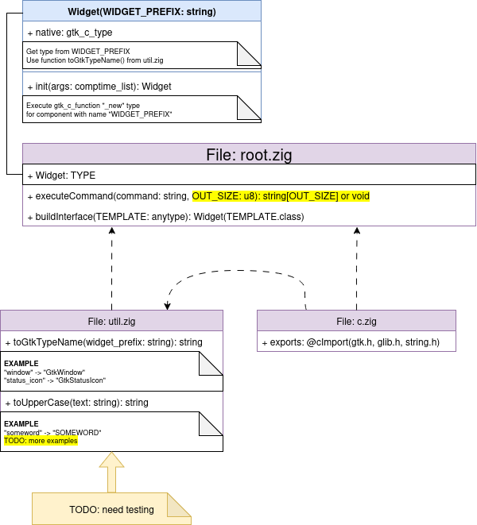

This directory contains images that illustrate how the project works.  
They are provided for better understanding of the concepts, structure, and functionality of the code.  

Feel free to check these images while exploring the project.

You can edit images by editing `*.drawio` files and export it as `*.png` files.
